# TradingView 新账号回测起步流程

本文不是 skill 说明，而是给刚注册完 TradingView 账号的人看的实操流程：先把浏览器、图表、策略、Strategy Tester、结果记录和复盘闭环跑稳定，再谈把真实策略迭代到年化收益率 20%。

这里的截图分两类：前半部分使用最小 EMA `strategy()` 讲清楚脚本是什么、怎么写、怎么添加到图表；后半部分使用 `TV Backtest Skill Chart Rich Fixture v4` 作为报告丰富 fixture，专门让 Strategy Tester 的统计图表有数据，便于讲清楚如何截图、记录和复盘。它们都只用于说明操作链路，不代表有效策略，也不能作为收益优化对象。

## 目标顺序

主目标是稳定操作闭环：

1. 打开已登录 TradingView 图表。
2. 确认品种、交易所、周期和图表类型。
3. 准备一个能添加策略的布局。
4. 把已给定的 Pine `strategy()` 加到图表。
5. 让 Strategy Tester 出现可审计指标。
6. 记录证据、完成 run record、写复盘结论。

次目标才是收益率：

- 只有当上面的闭环可重复时，才比较真实策略版本或用户提供的参数集。
- 20% 年化收益率不是第一轮浏览器操作的成功标准。
- 如果只有 smoke fixture，必须停止并请求真实策略或真实参数集。

## 0. 新账号先准备什么

刚注册完账号后，不需要先连接券商，也不需要先配置 webhook。第一轮只需要：

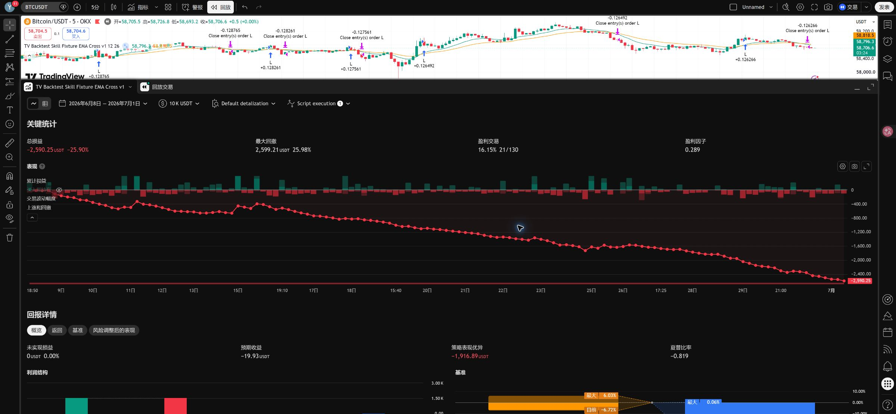

- 一个已登录的 Chrome / TradingView 页面。
- 一个测试品种，例如 `BTCUSDT`。
- 一个周期，例如 `5m`。
- 一个可执行 Pine `strategy()`，或者一个已经保存在账号里的策略。
- 一份记录结果的 run record。

不要一开始就追求收益率。先确认 TradingView 能稳定完成一次回测。

## 1. 先搞清楚“脚本”是什么

在 TradingView 里，脚本就是一段 Pine Script 代码。你可以把它理解成“告诉 TradingView 怎么画线、什么时候买、什么时候卖、怎么模拟成交”的文本。

新手最容易混淆两种脚本：

| 类型 | 开头声明 | 能不能回测 | 用途 |
| --- | --- | --- | --- |
| 指标脚本 | `indicator(...)` | 不能直接产生 Strategy Tester 交易结果 | 画均线、布林带、信号箭头、背景色 |
| 策略脚本 | `strategy(...)` | 可以回测 | 产生模拟买卖、订单标记、Strategy Tester 指标 |

本教程要跑回测，所以必须使用 `strategy(...)`。如果你只有 `indicator(...)`，TradingView 可以画线，但不会自动知道怎么开仓、平仓，也不会给出完整 Strategy Tester 结果。

## 2. 新手先复制一个最小可运行 strategy

下面这段是最小 smoke-test 脚本，用来确认你会写入、保存、添加到图表、打开 Strategy Tester。它不是赚钱策略，只是教学用的起步模板。

```pine
//@version=6
strategy("My First Backtest Strategy",
     overlay=true,
     initial_capital=10000,
     default_qty_type=strategy.percent_of_equity,
     default_qty_value=100,
     commission_type=strategy.commission.percent,
     commission_value=0.1,
     slippage=1,
     pyramiding=0)

fastLen = input.int(12, "Fast EMA", minval=1)
slowLen = input.int(26, "Slow EMA", minval=2)

fast = ta.ema(close, fastLen)
slow = ta.ema(close, slowLen)

if ta.crossover(fast, slow)
    strategy.entry("L", strategy.long)

if ta.crossunder(fast, slow)
    strategy.close("L")

plot(fast, "Fast EMA", color=color.teal)
plot(slow, "Slow EMA", color=color.orange)
```

逐行理解：

- `//@version=6`：告诉 TradingView 使用 Pine Script v6。
- `strategy(...)`：声明这是策略脚本。没有这一行，就不能当作回测策略。
- `overlay=true`：把策略画在主图 K 线上。
- `initial_capital=10000`：模拟账户初始资金是 10,000。
- `default_qty_type=strategy.percent_of_equity` 和 `default_qty_value=100`：每次用 100% 模拟权益下单。真实研究时可以改小。
- `commission_value=0.1`：模拟 0.1% 手续费。
- `slippage=1`：模拟 1 tick 滑点。
- `pyramiding=0`：不允许同方向连续加仓。
- `input.int(...)`：参数输入框，后续可以在策略设置里改。
- `ta.ema(close, fastLen)`：用收盘价计算 EMA。
- `ta.crossover(fast, slow)`：快线向上穿过慢线时触发。
- `strategy.entry("L", strategy.long)`：开多单，订单名是 `L`。
- `strategy.close("L")`：平掉名为 `L` 的多单。
- `plot(...)`：把快慢 EMA 画出来，方便肉眼检查。

你可以安全修改：

- 策略名字：`"My First Backtest Strategy"`。
- 快慢均线参数：`12` 和 `26`。
- 初始资金、手续费、滑点、下单比例。

暂时不要随便修改：

- `strategy.entry(...)`
- `strategy.close(...)`
- `ta.crossover(...)`
- `ta.crossunder(...)`

这些是交易逻辑。改错了，脚本可能还能运行，但回测含义已经变了。

### 写 strategy 脚本的固定骨架

以后自己写策略时，不要从空白页面乱写。先按下面 5 块填空：

1. 版本声明：`//@version=6`。
2. 策略声明：`strategy(...)`，设置资金、手续费、滑点、是否允许加仓。
3. 参数区：用 `input.*` 写可以调整的参数。
4. 计算区：用 `ta.*`、价格、成交量等数据算出信号。
5. 下单区：用 `strategy.entry(...)`、`strategy.close(...)` 或 `strategy.exit(...)` 把信号变成模拟交易。

把一句交易想法翻成 Pine，通常是这个顺序：

| 交易想法 | Pine 写法 |
| --- | --- |
| 计算 12 EMA 和 26 EMA | `fast = ta.ema(close, 12)`、`slow = ta.ema(close, 26)` |
| 快线向上穿过慢线时买入 | `buySignal = ta.crossover(fast, slow)` |
| 快线向下穿过慢线时卖出 | `sellSignal = ta.crossunder(fast, slow)` |
| 出现买入信号就开多 | `if buySignal` 下一行写 `strategy.entry("L", strategy.long)` |
| 出现卖出信号就平多 | `if sellSignal` 下一行写 `strategy.close("L")` |

也就是说，TradingView 不会自动理解“金叉买、死叉卖”。你必须把它写成明确的布尔信号和下单语句。只画线不等于下单，只有出现 `strategy.entry`、`strategy.close`、`strategy.exit` 这类函数，Strategy Tester 才知道要模拟交易。

## 3. 打开 Pine Editor，把脚本写进去

Pine Editor 是 TradingView 内置的脚本编辑器。你不需要安装 VS Code，也不需要在本地运行 Pine。Pine 代码是在 TradingView 页面里保存，并由 TradingView 云端执行。

如果下方面板没有 Pine Editor，可以点右侧工具栏里的 `Pine` 图标打开。

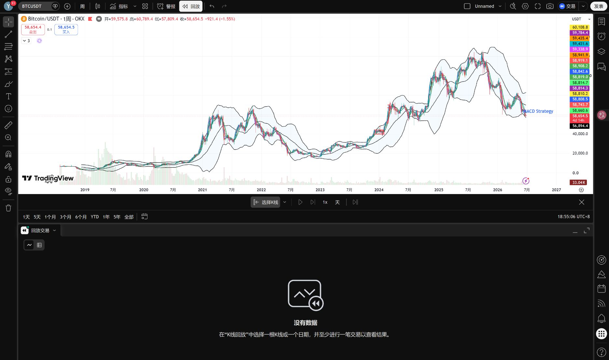

打开后会看到右侧或下方出现 Pine 编辑器。中间黑色区域就是代码区。

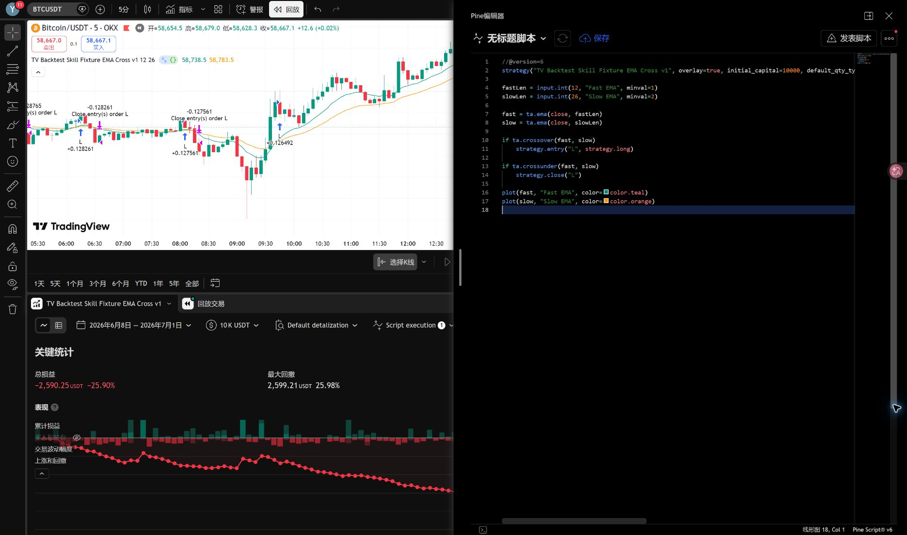

近距离看，编辑器里有三块关键区域：

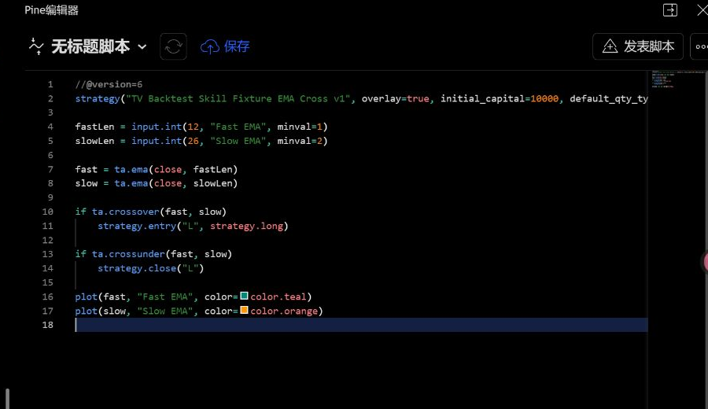

操作顺序：

1. 点击代码区。
2. 按 `Ctrl+A` 全选旧代码。
3. 粘贴上面的最小 `strategy()` 脚本，或粘贴你自己的真实策略。
4. 检查第一行是 `//@version=6`。
5. 检查第二段里有 `strategy(`，不是 `indicator(`。
6. 点击 `保存`。
7. 如果 TradingView 要求脚本名称，用策略名加版本号，例如 `My First Backtest Strategy v1`。
8. 保存后点击 `添加到图表` 或同等按钮，让脚本真正跑在当前图表上。

注意：截图右上角的 `发表脚本` 是公开发布脚本的入口。新手测试私有回测时不要点击它。你只需要保存并添加到图表。

## 4. 打开已登录图表

进入 TradingView 后，先打开图表页。新账号常见起点是空白图表、默认布局，或者之前留下了一堆指标。


要点：

- 地址栏应在 `tradingview.com/chart/...` 或 `cn.tradingview.com/chart/...`。
- 顶部能看到当前品种、周期、指标、警报、回放等控件。
- 右上角账号状态应是已登录状态。
- 不要刷新正在操作的图表，除非你明确要重置布局。

## 5. 确认品种、交易所和周期

先固定测试环境，再运行策略。否则不同品种、周期和数据源会让结果不可比较。

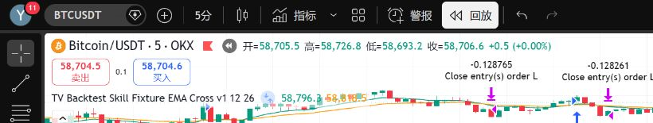

截图中的环境是：

- 品种：`BTCUSDT`
- 交易所：`OKX`
- 周期：`5m`
- 图表类型：K 线图

记录这些字段是为了后续复盘能回答一个基础问题：这次结果到底是在什么市场条件下跑出来的。

## 6. 先清理布局阻塞

新账号或免费账号可能遇到指标数量限制。策略 `strategy()` 加到图表时也会占用一个指标槽位。如果图表上已经堆了很多指标，Strategy Tester 可能无法正常工作。

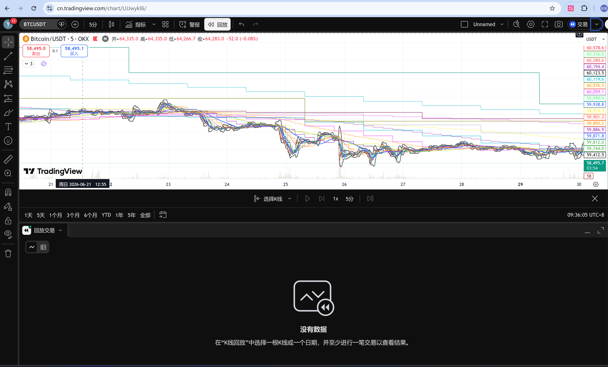

处理顺序：

1. 优先新建空白布局。
2. 如果必须复用当前布局，只移除明确无关的指标。
3. 移除前先备份指标名称或截图。
4. 不要删除用户未确认要删的指标。

这张图里下方面板显示“没有数据”，说明这还不是可复盘结果，只是一个需要整理的起点。

## 7. 确认策略已经添加到图表

`backtest-skill` 不负责发明策略。它只接受已经给出的 Pine `strategy()`、已保存策略、Strategy Tester 结果，或明确的参数集。

策略加到图表后，至少要能看到策略名称和订单标记。

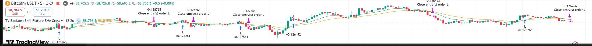

判断标准：

- 图表左上角出现策略名称。
- 图表上出现买入、卖出、平仓等订单标记。
- 代码必须是 `strategy()`，不能只是 `indicator()`。

注意：订单标记只证明策略被加到图表，不证明回测指标已经可用。真正的证据来自 Strategy Tester。

## 8. 打开 Strategy Tester 并捕获关键统计

策略添加成功后，打开 Strategy Tester 或 Strategy Report。第一眼先看关键统计。

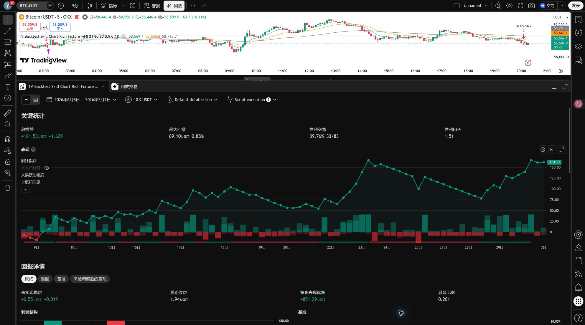

这次报告丰富 fixture 的截图用于证明报告链路已经跑通。截图中的核心字段是：

- 总损益：约 `+161 USDT / +1.6%`
- 最大回撤：`89.10 USDT / 0.88%`
- 盈利交易：`39.76% / 33 of 83`
- 盈利因子：`1.51`

这个结果只说明浏览器回测、报告渲染和截图采集链路跑通了。它仍然是 fixture，不是可交易策略。不要因为截图里是正收益，就把它解释成已经达到年化 20% 或已经可实盘。

## 9. 看权益曲线和回撤形态

关键统计之外，还要看权益曲线。它能快速暴露策略是否持续失血、是否靠少数交易撑住结果，或者是否完全没有稳定性。

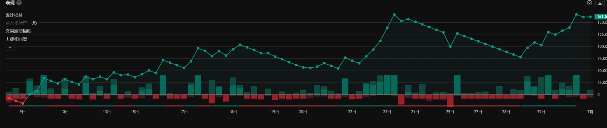

截图中累计收益曲线、交易波动幅度和上涨/回撤柱都能显示，说明报告图表已经不是空白状态。复盘时看这张图，不是为了判断策略能不能赚钱，而是为了确认结果证据是否完整。

如果这一页看不到权益曲线，或只有订单标记但没有 Strategy Tester 曲线，正确动作是：

- 先不要写“回测成功”。
- 检查当前脚本是否真的是 `strategy()`。
- 检查当前日期范围内是否有足够交易。
- 必要时先换成报告丰富 fixture 或更长样本，再重新截图。
- 仍然无数据时，记录为 blocked run。

## 10. 打开回报详情做复盘

Strategy Tester 的“回报详情”用于补充关键统计看不到的信息，例如买入持有对比、策略表现优异度、夏普比率、利润结构、交易分布、股权上涨和下跌、资本效率等。

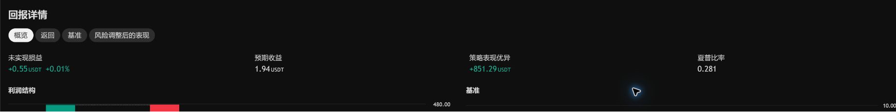

这里有一个硬规则：如果某一屏出现“没有足够的数据显示”，不要把这张图放进教程里当作成功结果。先改策略样本或扩大样本，让对应图表真正有数据，再重新截图。

本次缺失数据出现在“股权上涨和下跌”区域。处理方式不是继续讲空图，而是先把策略换成 `TV Backtest Skill Chart Rich Fixture v4`，让权益曲线有多次上涨和回撤，再重新打开 Strategy Tester、最大化报告面板、向下滚动检查该区域。

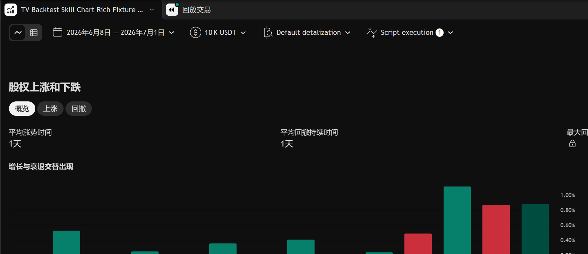

逐屏检查顺序：

1. 先看关键统计：总损益、最大回撤、盈利交易、盈利因子。
2. 再看权益曲线：累计收益、交易波动幅度、上涨和回撤是否都有数据。
3. 向下滚动看回报详情：利润结构、基准、交易分析、Returns distribution、交易分配。
4. 继续向下滚动看股权上涨和下跌、资本效率、保证金使用。
5. 任何一屏出现空图，都回到策略样本或日期范围处理，不继续截图讲解。

复盘时至少写清楚：

- 本轮是最小 smoke fixture、报告丰富 fixture，或真实策略。
- 是否拿到了 Strategy Tester 指标。
- 是否有截图、导出或复制表格作为证据。
- 结果是通过、观察、继续迭代，还是直接拒绝。
- 下一轮允许改什么：只允许改用户给定的版本或参数，不允许现场发明交易逻辑。

## 11. 写 run record

每一轮回测都要留下结构化记录。最小字段如下：


```json
{
  "strategy": {
    "name": "TV Backtest Skill Chart Rich Fixture v4",
    "version": "report-rich-v4",
    "fixture_only": true
  },
  "market": {
    "symbol": "BTCUSDT",
    "exchange": "OKX",
    "timeframe": "5m",
    "date_range": "2026-06-08 to 2026-07-01"
  },
  "metrics": {
    "net_profit_pct": 1.61,
    "max_drawdown_pct": 0.88,
    "win_rate_pct": 39.76,
    "profit_factor": 1.51,
    "total_trades": 83
  },
  "decision": "operation_loop_verified_not_trade_ready",
  "next_step": "request a real Pine strategy, saved TradingView strategy, tester artifact, or supplied parameter set"
}
```

如果 Strategy Tester 没有数据，就不要补猜指标。记录为 blocked run，并说明阻塞点。

## 12. 决定下一轮怎么迭代

本流程跑通后，才进入收益目标阶段。判断顺序是：


1. 操作链路是否稳定？
2. 证据是否完整？
3. 当前策略是否是真实策略，而不是 smoke fixture？
4. 是否有用户提供的下一组参数或版本？
5. 年化收益、最大回撤、交易数、盈利因子是否同时可接受？

如果答案 1 和 2 是“否”，继续修浏览器和结果采集。

如果答案 3 或 4 是“否”，请求真实策略或参数。

只有全部满足后，才讨论年化收益率是否能逐步逼近或超过 20%。

## 常见阻塞与处理

| 阻塞 | 现象 | 处理 |
| --- | --- | --- |
| 指标槽位不足 | 策略无法添加到图表 | 新建空白布局，或在备份后移除明确无关指标 |
| 只有订单标记 | 图表有箭头，但 Strategy Tester 无指标 | 不算完成，必须继续打开报表或记录 blocked run |
| Pine 是 `indicator()` | 无法产生策略交易 | 请求 `strategy()` 版本，不在本流程里发明交易规则 |
| 保存后没有交易 | 图上只有均线，没有买卖箭头 | 检查是否真的点击了添加到图表，或当前时间范围内没有穿越信号 |
| 找不到添加按钮 | 只看到 `发表脚本` | 不要发布；先保存脚本，查找 `添加到图表`、运行按钮或脚本菜单里的添加动作 |
| 编译报错 | 编辑器下方出现红色错误 | 先检查是否漏了逗号、英文引号、缩进，或把 `indicator()` 和 `strategy()` 混在一起 |
| 报表空白 | 下方面板显示无数据 | 先检查脚本是否为 `strategy()`、日期范围是否有交易、样本是否足够；作为教程截图前必须先换策略样本或扩大样本重新截图，仍无数据才记录 blocked run |
| 子图缺数据 | 某个报告块显示“没有足够的数据显示” | 不把空图当成功证据；先改成能产生该类统计的 fixture 或更长样本，再向下滚动复查 |
| 只有 smoke fixture | 能出报告但不是用户真实策略 | 只证明链路可用，不能进入收益率优化 |

## 附录：如何理解本次截图

你看到的完成态截图属于“前期进展”：TradingView 浏览器操作、策略上图、Strategy Tester 出数和关键指标读取已经跑通。

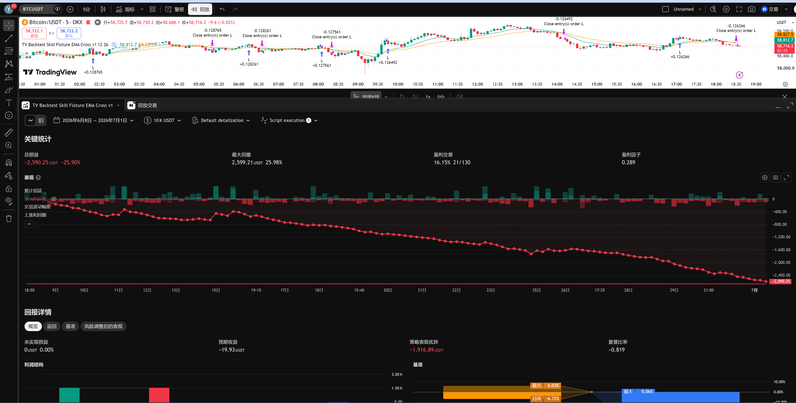

但这不是收益目标达成。图里的策略是 fixture，即使报告丰富版本能让统计图表有数据，也只说明操作链路可用。下一步仍然必须明确为：提供真实 Pine `strategy()`、已保存 TradingView 策略、Strategy Tester artifact，或用户指定的参数/版本集合。

## 完成标准

一次“刚注册后开始回测”的流程完成，必须满足：

- 已登录图表可访问。
- 品种、交易所、周期和日期范围已记录。
- 可执行策略已添加到图表。
- Strategy Tester 指标已截图或导出。
- run record 已写入。
- 复盘结论已明确。
- 下一轮请求已明确。

完成这些之前，不要把年化 20% 当作当前阶段目标。
